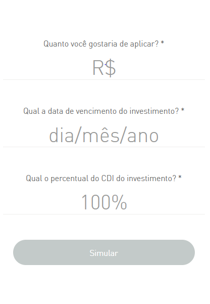

# Teste de iOS Developer Easynvest
Este teste é apresentado aos candidatos as vagas de iOS Developer para avaliar os quesitos técnicos.

### O Desafio

Seu objetivo é usar o template de projeto fornecido para desenvolver um app com duas telas, uma que exibe um formulário e outra que exibe o resultado de uma API.
Lembrando de que essa é uma oportunidade de mostrar todo o seu conhecimento então leve o tempo que precisar e capriche no desenvolvimento que prometemos avaliar com o maior carinho. :)

### Telas




Para o desenho das telas, não precisa se preocupar com a interface na horizontal;

## Consumindo o serviço de cálculo
A API que calcula o os valores futuros seguem o padrão descrito abaixo:

 - **URL**: https://run.mocky.io/v3/ecfaebf5-782b-4b24-ae4f-23b5c3a861da
 - **Method**: GET
 - **URL Params**:
    ```javascript
        investedAmount = 32323.0                 // Valor a investir em reais
        index = "CDI"                            // Índice, por enquanto só CDI disponível
        rate = 123                               // Percentual do papel
        isTaxFree = false                        // Isento de IR, por enquanto só falso
        maturityDate = "2023-03-03"              // Data do vencimento, no formato ano-mes-dia
    
    ```
 - **Response**
    ```javascript
    {
        "investmentParameter": {
            "investedAmount": 32323.0,                      // O valor a ser investido
            "yearlyInterestRate": 9.5512,                   // Rentabilidade anual
            "maturityTotalDays": 1981,                      // Dias corridos
            "maturityBusinessDays": 1409,                   // Dias úteis
            "maturityDate": "2023-03-03T00:00:00",          // Data de vencimento
            "rate": 123.0,                                  // Percentual do papel
            "isTaxFree": false                              // Isento de IR
        },
        "grossAmount": 60528.20,                            // Valor bruto do investimento
        "taxesAmount": 4230.78,                             // Valor do IR
        "netAmount": 56297.42,                              // Valor líquido
        "grossAmountProfit": 28205.20,                      // Rentabilidade bruta
        "netAmountProfit": 23974.42,                        // Rentabilidade líquida
        "annualGrossRateProfit": 87.26,                     // Rentabilidade bruta anual
        "monthlyGrossRateProfit": 0.76,                     // Rentabilidade bruta mensal
        "dailyGrossRateProfit": 0.000445330025305748,       // Rentabilidade bruta diária
        "taxesRate": 15.0,                                  // Faixa do IR (%)
        "rateProfit": 9.5512,                               // Rentabilidade no período
        "annualNetRateProfit": 74.17                        // Rentabilidade líquida anual
    }
    ```

### Pré-requisitos: 
 - Swift;
 - Target iOS 11;
 - Utilizar autolayout;
 - Usamos SwiftLint aqui (https://github.com/realm/SwiftLint) e gostaríamos que seu código seguisse o mesmo padrão que a gente :) As regras estão no ./linter/.swiftlint.yml;

### Bônus:
 - URLSession + Codable;
 - Coordinators;
 - ViewCode;

### O que esperamos:
 - Testes, no mínimo testes unitários;
 - Padrão de Projeto e boas práticas de Orientação a Objetos;
